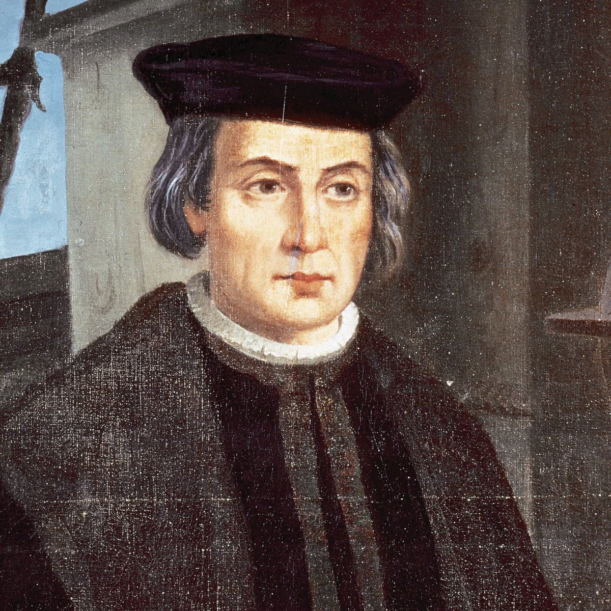

## Christopher Columbus

Christopher Columbus (1451–1506)  was an Italian explorer, colonizer, and navigator. He is remembered as the principal European discoverer of the Americas and he helped bring the Americas to the forefront of the western consciousness. His discoveries and travels laid the framework for the later European colonisation of Latin and North America.
Christopher Columbus was born in the Republic of Genoa, in what is today Northwestern Italy. His father was a middle-class wool merchant, though it was relatively humble beginnings for what he later became. Columbus learnt to sail from an early age and later worked as a business agent, travelling around Europe to England, Ireland and later along the West coast of Africa. He was not a scholar but was an enthusiastic self-educated man, who read extensively on astronomy, science and navigation. He also became fluent in Latin, Portuguese and Spanish.

Christopher Columbus was a believer in the spherical nature of the world (some Christians still held the view that the world was flat). An ambitious man, Christopher Columbus hoped to find a Western trade route to the lucrative spice markets in Asia. Rather than sailing east, he hoped that sailing west would lead to countries like Japan and China.

To gain the necessary funding and support for his journeys, he approached the Catholic Monarchs of Spain. As part of his offer, he said that he hoped to be able to spread Christianity to ‘heathen lands’ in the east. The Spanish monarchs agreed to fund Columbus, partly on the Christian missionary efforts, but also hoping to gain an upper hand in the lucrative trade markets. One advantage of the westward exploration is that it avoided conflict with the growing power of the Ottomans in the east.

Columbus’ first voyage was completed in 1492. He had intended to sail to Japan but ended up in the Bahamas, which he named San Salvador.

Columbus made a total of four journeys, where he sailed extensively around the Caribbean islands of Cuba, Jamaica, the Bahamas and also to the mainland, to places such as Panama.

Columbus was not the first person to reach America. Previous successful voyages included a Norse expedition led by Leif Ericson. However, Columbus was the first to travel to America and establish permanent settlements. Columbus’ voyages and reports, over the next 400 years encouraged all the major European powers to seek to colonise parts of America.

Columbus was a skilled navigator with tremendous faith in the possibilities of exploration. He claimed in his diary entries, his steely will held the crew together when they feared they would never reach land.

However, his autocratic style created friction on the boats that he guided. Columbus was deeply religious and his tendency to be sanctimonious and judgemental of personal failings was not popular with sailors who took a more earthy and realistic approach to life. Yet, whilst he was pious in some regards, he also shared the view, common at the time, that European Christians had a moral superiority due to their following the one true faith. Although Columbus held back some of the worst excesses of his sailors, he took back human slaves and looted property from the indigenous people.

As part of the deal, the Spanish monarchy appointed Columbus Viceroy and Governor of the Indies in the island of Hispaniola. He also delegated the governorship to his brothers. However, in 1500, on the orders of the Spanish monarchy, Columbus was arrested and placed in chains. There were allegations of incompetence, misrule and barbaric practices in the governorship of the new colonies. After several weeks in jail, Columbus and his brothers were released, but Columbus was not allowed to be governor of Hispaniola anymore.

Towards the end of his life, Columbus became increasingly religious. In particular, he became fascinated with Biblical prophecies and wrote his own ‘Book of Prophecies’ (1505). He was also frustrated with his lack of public recognition and seeming demotion in the eyes of the Spanish monarchs. In 1503, he wrote a letter to the monarchs laying out his sense of unappreciated sacrifice

